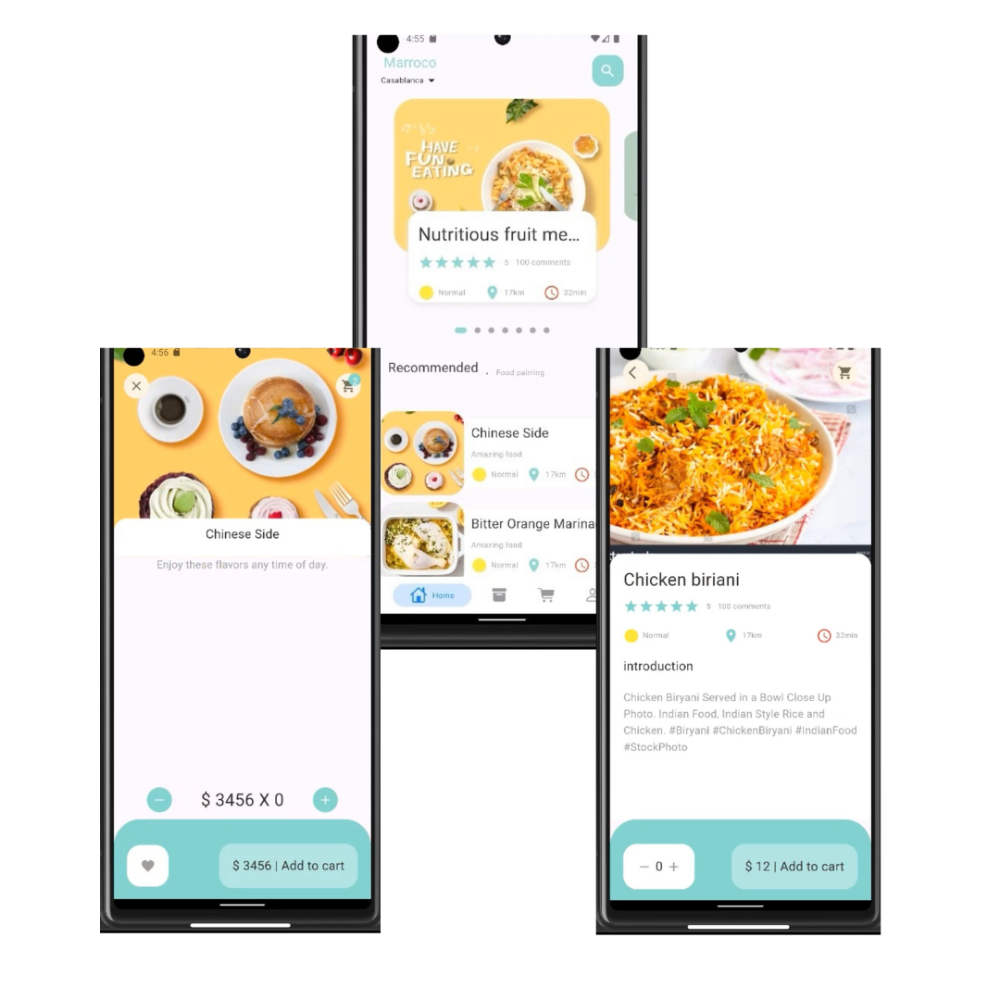

# Food delivery mobile app
A mobile application for food delivery built with Flutter, accompanied by a web application developed with Laravel, which provides data to the mobile app via a REST API.

;

